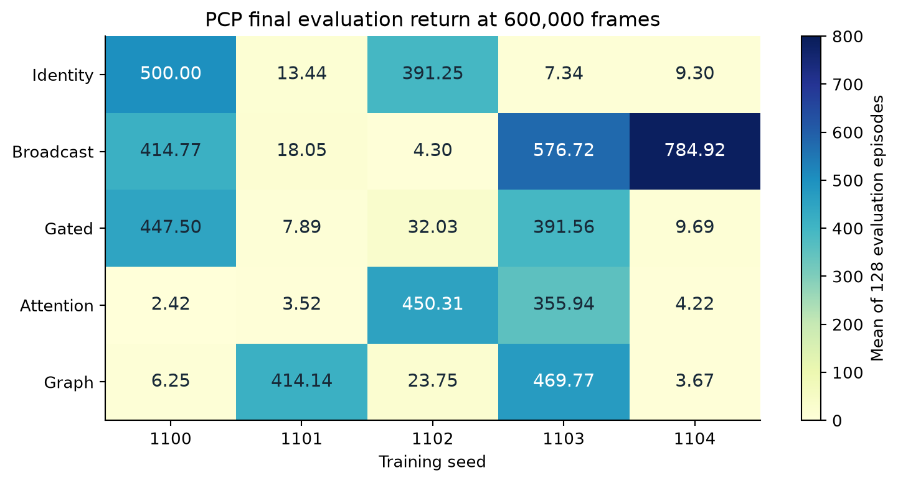
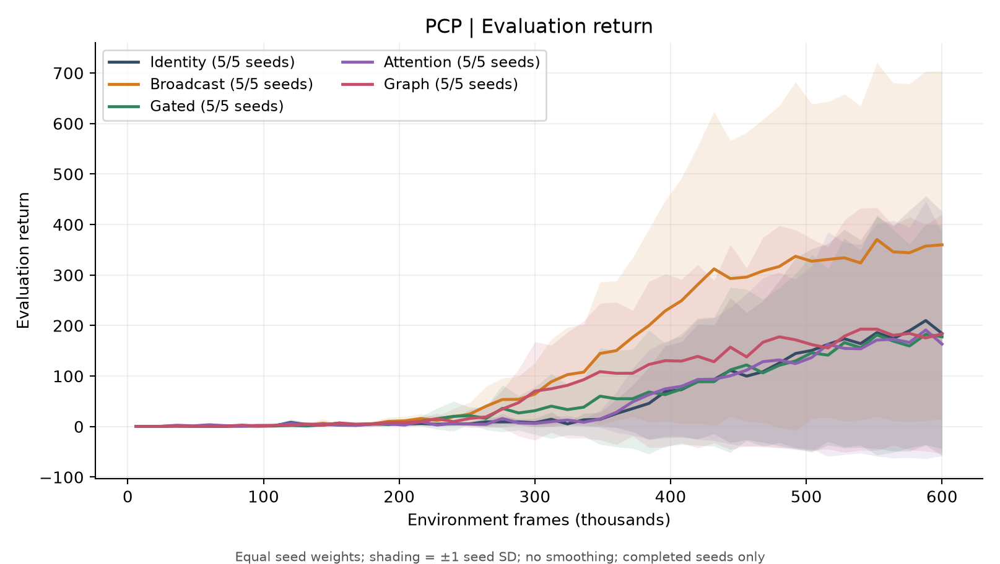
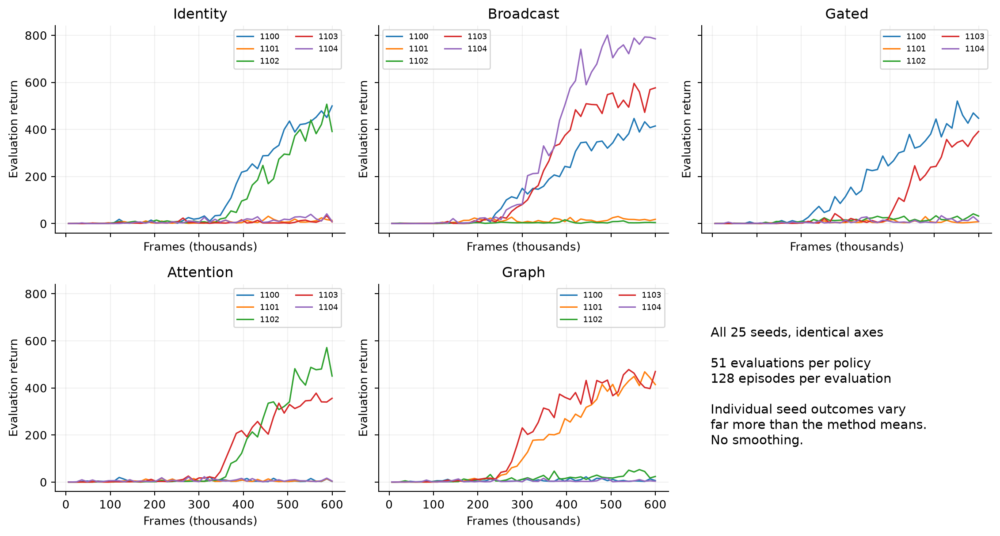
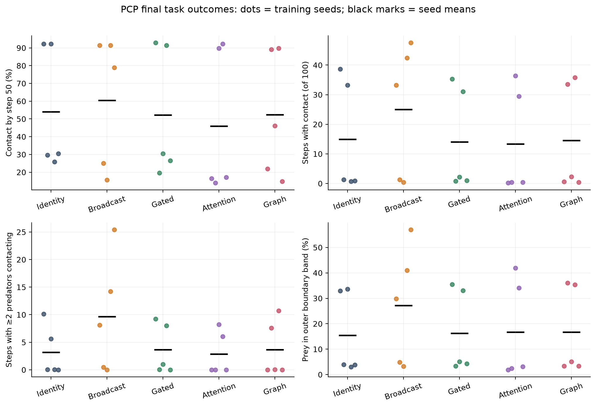
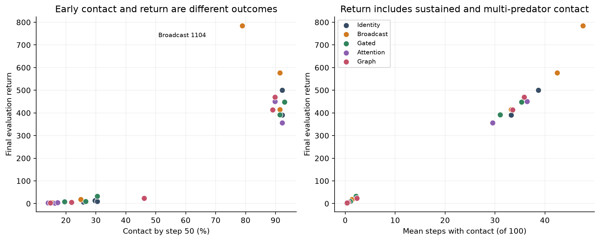
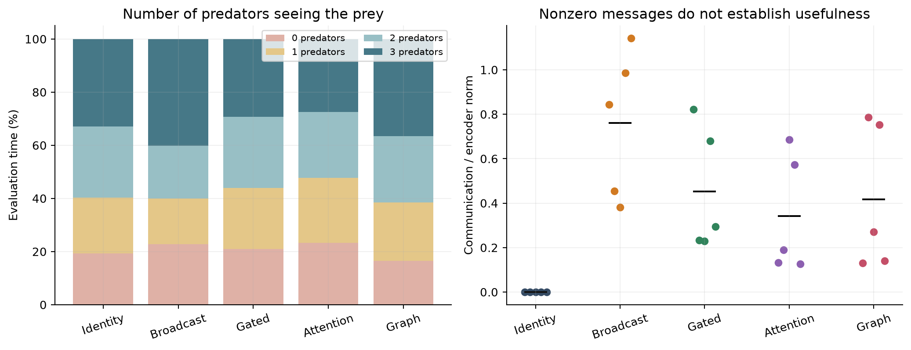
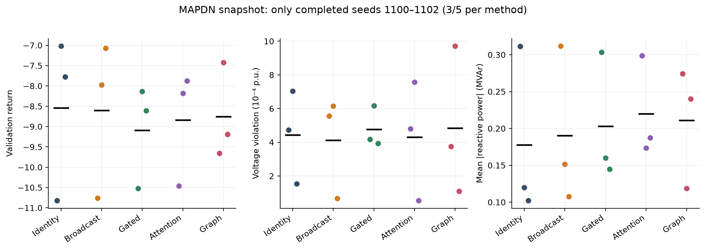

# Useful communication, learning reliability, and information access

## Research direction review from completed PCP runs and a partial MAPDN comparison

**25 September 2026 · Research decision document**

**Evidence:** 25 completed PCP policies; 15 completed MAPDN policies and five partial trajectories; the four supplied direction guides; primary research literature checked on the analysis date.

**Recommendation:** Make **information access, local memory, and communication failure** the main explanatory question, following Guide 1. First use a bounded evaluation of the existing PCP checkpoints to determine what their messages actually contribute. Keep the present PCP/MAPDN comparison as the empirical foundation. Treat sensing-role recovery, Guide 3, as the preferred alternative if the first controlled pilot does not produce an informative result. Defer the new cooperative-sensing simulator in Guide 2.

This recommendation is a judgment about scientific clarity and achievable scope. It does not depend on obtaining a positive communication effect, and it is not a prediction of publication acceptance. The strongest thesis would explain a reproducible mechanism and its limits, with a useful result under either a positive or a negative outcome.

---

## 1. The findings that should drive the decision

The initial impression that Identity beats every communication method is **not the result across all five training seeds**. Identity's return of 500 is seed 1100. Its other final returns are 13.44, 391.25, 7.34, and 9.30. Broadcast has the highest observed mean, 359.75, compared with Identity's 184.27. Attention and Graph each also have two seeds with substantial learned performance. The central problem is the large variation between independently trained policies, rather than a clean division between a working local method and four broken communicating methods. [Seed results](tables/seed_return_summary.csv)

There are four immediate conclusions:

1. **Broadcast is the most promising current comparator, but superiority is unresolved.** It leads on final return, the average of the final five evaluations, and the time average of the recorded learning curve. Five highly variable seeds provide weak precision for a population-level ranking.
2. **PCP return is largely a sustained-contact outcome.** It counts rewarded predator–prey contact on every transition, including simultaneous contacts. It is not the number of distinct prey captures. More return can come from longer contact after interception, without a higher probability of early interception.
3. **Current logs establish learning outcomes and message activity, not a causal information benefit.** There is no same-policy message-removal experiment in this batch, no active local capacity control, and no memory comparison. These are missing comparisons, not missing communication modules.
4. **The completed MAPDN subset has no clear return winner.** Its physical outcomes and reward can rank methods differently. The remaining two seed blocks are necessary before closing that comparison.

| Decision | Recommended action | Evidence or reason |
| --- | --- | --- |
| Abandon communication because Identity wins? | No; correct the aggregate interpretation first. | Broadcast has the largest observed PCP mean; every method has both high- and low-return seeds. |
| Run another broad architecture sweep? | Low priority. | Five methods already show a learning-reliability problem that ranking alone does not explain. |
| Increase every training budget immediately? | Defer until a bounded diagnosis. | Some curves are still improving, but longer training would not identify useful information or eliminate the capacity confound. |
| Keep PCP? | Yes, as an existing diagnostic and baseline chapter. | Complete artifacts, measured contact outcomes, and affordable evaluation make it valuable. |
| Primary new direction? | Guide 1: information, memory, and failures. | It supplies controlled references for interpreting communication failure. |
| Preferred alternative? | Guide 3: information-source handover. | A concrete failure-recovery question with fixed team size and modest architecture work. |
| Start the sensing-and-relaying simulator now? | No; require a successful non-learning feasibility check first. | The estimator and transport system would introduce several new failure sources. |

The best immediate action is therefore **an explanation of the existing result followed by one controlled pilot**, rather than choosing a new architecture on the basis of a single seed.

## 2. What was inspected and how results were measured

### 2.1 Evidence boundary

The analysis used the locally supplied `logs/PCP` and `logs/MAPDN` directories. The filesystem treats upper- and lowercase directory spellings as the same locations here. No live Newton job was queried or changed. MAPDN status statements describe this copied snapshot, not the current scheduler state.

PCP contains all 25 expected completed runs: five methods and seeds 1100–1104, each at 600,000 joint environment frames. MAPDN contains all five methods completed for seeds 1100, 1101, and 1102, each at 131,072 frames. Seed 1103 is partial for every method; seed 1104 is absent from this snapshot. There is no separate completed seed named 0101. [Run inventory](tables/run_inventory.csv)

For MAPDN seed 1103, the latest recorded training frames are 24,576 for Identity, 20,480 for Broadcast, 19,712 for Gated, 16,384 for Attention, and 11,520 for Graph. These trajectories appear only as explicitly labeled partial seed curves. They do not enter completed-seed aggregates or endpoint tables.

The two recorded Git revisions differ: PCP reports `05047b317c1447b26a1cad7a57152da291d68009`; MAPDN reports `fee0e6b7644c0063536e9bc8828683608678b5e2`. Their recorded source fingerprint is identical: `afb243cdabafcd48dd497f7206931a65af220b101a91993fd69ac6c8d767b3c5`. The package source diff between these revisions is empty. The environment settings and scientific tasks still differ and are analyzed separately. [PCP provenance](../../logs/PCP/provenance.json), [MAPDN provenance](../../logs/MAPDN/provenance.json)

### 2.2 Artifact checks

The 40 completed policies all have metric CSVs and checkpoints matching the SHA-256 checksums in their status records. Their terminal evaluation returns agree between CSV and `.out` at absolute tolerance 1e-12. Across all 45 available per-policy metric CSVs, including the partial MAPDN jobs, there are no nonfinite values or duplicate frame/iteration/phase/group/metric/sample keys. All recorded PCP reward-accounting errors are zero. All recorded MAPDN solver-failure counts are zero. These checks support artifact consistency and numerical execution; they do not prove optimal learning or the absence of every scientific design issue.

The analysis reads the individual seed CSVs as its source of truth. In particular, MAPDN does not yet have the coordinator's final combined CSV. Original experiment files were left intact. A [source manifest](tables/source_manifest.csv) records hashes and file sizes; all derived figures and tables are inside this report directory.

### 2.3 Shared analysis rules

The headline endpoint is the **final scheduled evaluation**, not the best checkpoint or the largest return seen during training. PCP uses deterministic actions and 128 complete 100-step evaluation episodes at each recorded evaluation. Its first evaluation is after the first batch, at frame 6,000, followed by 12,000-frame intervals through 600,000: 51 evaluations per policy. This is not a frame-zero baseline. MAPDN analogously starts at frame 256, then evaluates every 8,192 frames through 131,072, with 16 complete 239-step episodes per evaluation.

Episodes are averaged within a policy first; policies receive equal weight within each method. Curves align on recorded frames with no smoothing, interpolation, or extrapolation. Comparison bands show **±1 sample standard deviation across training seeds**, not confidence intervals. Individual seed figures retain failed-to-learn trajectories, and MAPDN figures label completed/expected counts.

Two secondary return summaries check sensitivity to the last evaluation: the average of the final five recorded evaluations, and the trapezoidal time average over the recorded learning curve. The latter covers frames 6,000–600,000 for PCP and 256–131,072 for completed MAPDN runs. It summarizes the connected recorded points; it does not infer performance before the first evaluation. Neither secondary summary replaces the stated endpoint.

Descriptive 95% intervals for method differences use nominal training-seed blocks: compute each method's endpoint minus Identity's endpoint for each seed, then use a Student-t interval over those differences. With five PCP or three MAPDN seeds, normality is unverified and the distributions are visibly irregular. These intervals are uncertainty diagnostics, not confirmatory significance tests; they are not adjusted for the four comparisons. Matching seed numbers also does not guarantee identical initialized weights or identical training trajectories across architectures. No equivalence or universal ranking follows from an interval crossing zero. The importance of uncertainty in small-run RL evaluation is well established. [Agarwal et al., 2021](https://proceedings.neurips.cc/paper/2021/hash/f514cec81cb148559cf475e7426eed5e-Abstract.html)

## 3. PCP: the actual return comparison

### 3.1 Every final seed

| Method | 1100 | 1101 | 1102 | 1103 | 1104 |
| --- | --- | --- | --- | --- | --- |
| Identity | 500.00 | 13.44 | 391.25 | 7.34 | 9.30 |
| Broadcast | 414.77 | 18.05 | 4.30 | 576.72 | 784.92 |
| Gated | 447.50 | 7.89 | 32.03 | 391.56 | 9.69 |
| Attention | 2.42 | 3.52 | 450.31 | 355.94 | 4.22 |
| Graph | 6.25 | 414.14 | 23.75 | 469.77 | 3.67 |

Each entry is one policy's mean over 128 evaluation episodes at 600,000 frames. The independent training replication is five policies per method, not 640 independent policies.

**Figure 1.** The high/low pattern is visible for every method. The particular seed that succeeds changes with the communication module.

### 3.2 Method summaries and uncertainty

| Method | Final mean ± SD | Median | Final-five mean | Curve time average |
| --- | --- | --- | --- | --- |
| Identity | 184.27 ± 241.68 | 13.44 | 188.82 | 54.12 |
| Broadcast | 359.75 ± 344.23 | 414.77 | 355.44 | 138.23 |
| Gated | 177.73 ± 221.82 | 32.03 | 174.08 | 57.91 |
| Attention | 163.28 ± 221.48 | 4.22 | 173.02 | 52.96 |
| Graph | 183.52 ± 236.86 | 23.75 | 183.37 | 77.20 |

The final-five window is frames 552,000, 564,000, 576,000, 588,000, and 600,000. Broadcast's leading point estimate persists under that window and the learning-curve summary, so it is not merely a lucky last evaluation. However, the gaps among Identity, Graph, Gated, and Attention are small relative to their seed variation. [Method summaries](tables/method_return_summary.csv)

| Versus Identity | Mean difference | Descriptive 95% paired interval | Positive seed blocks |
| --- | --- | --- | --- |
| Broadcast | +175.48 | [-422.85, 773.82] | 3/5 |
| Gated | -6.53 | [-334.60, 321.53] | 2/5 |
| Attention | -20.98 | [-398.88, 356.91] | 2/5 |
| Graph | -0.75 | [-539.58, 538.08] | 2/5 |

Broadcast's nominal paired advantage is +175.48 return units, with a very wide descriptive interval of approximately −422.85 to +773.82. It beats Identity for three of the five nominal seed blocks. This supports investigating Broadcast, not declaring a reliable 95% improvement from the ratio of the two means. The ratio would conceal both failures to learn and unstable denominators.

**Figure 2.** Equal-weight seed means with ±1 seed SD. Wide bands reflect actual training variation; negative lower bands are a graphical consequence of mean ± SD, not negative observed PCP returns.

**Figure 3.** Individual trajectories are essential. Several policies remain near their initial performance throughout training, while others improve sharply after a long low-return period. This pattern is compatible with difficult discovery or optimization, but these logs do not identify its cause.

### 3.3 Learning reliability is the stronger present finding

At the endpoint, 11 policies have returns above 355 and 14 have returns below 33. There are no policies between those two groups. As an explicitly exploratory description, a threshold of 100 identifies three high-return Broadcast seeds and two for each other method. The counts are unchanged using the final-five averages. Thresholds anywhere inside the observed gap give the same partition; this is not a preregistered definition of solving the task and is not a claim that the underlying distribution is mathematically bimodal.

At the first recorded evaluation, mean contact probabilities are only 1.25% for Identity and 1.5625% for each communicating method. Sparse initial reward is therefore visible in the logs. Under the current unshaped reward and `gamma = 0.95`, a reward 50 transitions away receives a direct discount factor of approximately 0.077. This makes delayed credit a reasonable diagnostic hypothesis, not an established explanation for the seed split. Critics, exploration, optimizer updates, and the environment all interact with that factor.

Some successful curves are still improving at the budget limit, while some endpoint drops simply occur between noisy evaluations. For example, Attention seed 1102 has a final-five average of 493.36 and a final return of 450.31; Identity seed 1102 has corresponding values 428.33 and 391.25. Their final drops do not by themselves demonstrate catastrophic forgetting. Conversely, the long flat trajectories of other seeds should not be hidden by reporting only successful seeds or best checkpoints.

The current result is most accurately described as **inconsistent acquisition of a high-contact behavior under a common finite training budget**. Whether communication changes the probability of finding that behavior remains uncertain.

## 4. What PCP return means physically

### 4.1 The reward is contact occupancy

The task has three trained homogeneous predators and one scripted prey, a 100-step horizon, sensing radius 1.0, no distance shaping, shared predator rewards, and no respawn on contact. The implementation supplies each predator with ten reward units for every predator–prey contact pair on each step. Consequently, for this configuration:

`episode return = 10 × total predator–prey contact-pair steps`.

This equality holds exactly for every one of the 3,200 final evaluation episodes in the supplied PCP files. The shared team reward is averaged across predators in the headline metric; it is not summed three times. A return of 500 therefore corresponds to an average of 50 contact-pair steps, not 500 captures or necessarily 50 distinct contact events. There is also no requirement that two predators contact simultaneously before reward is earned. [Reward definition](../../src/commstudy/tasks/pcp_metrics.py), [episode measurements](../../src/commstudy/tasks/pcp_statistics.py), [final episode table](tables/pcp_final_episodes.csv.gz)

This is a legitimate reward, but it answers a different operational question from first contact by a deadline or coordinated capture that requires multiple predators. The thesis should name the implemented behavior precisely.

### 4.2 Task outcomes across seeds

| Method | Contact by 50 | Any contact by 100 | Contact steps | Simultaneous-contact steps |
| --- | --- | --- | --- | --- |
| Identity | 54.06% | 55.16% | 14.97 | 3.16 |
| Broadcast | 60.47% | 62.03% | 25.01 | 9.64 |
| Gated | 52.19% | 53.59% | 14.05 | 3.66 |
| Attention | 45.94% | 47.34% | 13.38 | 2.86 |
| Graph | 52.34% | 54.06% | 14.53 | 3.68 |

“Contact by step 50” is derived from the observed-contact flag and the one-based first-contact step, including no-contact episodes as failures. It is an exploratory analysis of this batch, motivated by the earlier guide's deadline metric; it was not retrospectively made this run's preregistered primary endpoint. The probability of any contact by step 100 is also retained in the accompanying tables.

Broadcast improves the observed mean early-contact probability by **6.41 percentage points** over Identity, while its mean return is almost twice as high. The descriptive paired interval for that early-contact difference is extremely wide, approximately −62.54 to +75.35 points. Its observed return advantage includes more contact duration and more simultaneous contact. It cannot all be described as finding the prey more reliably.

**Figure 4.** Each dot is a training seed; the black mark is its method's mean. The spread is not hidden inside pooled episode counts.

The clearest example is Broadcast seed 1104. It reaches mean return **784.92**, but contact by step 50 is **78.91%**. Identity seed 1100 has lower return, **500.00**, but early contact **92.19%**. Broadcast 1104 maintains any contact for 47.59 steps and simultaneous contact for 25.42 steps on average; Identity 1100 has 38.70 and 10.11 steps respectively. Neither policy is unconditionally better across these objectives.

**Figure 5.** Return and early-contact probability are related but distinct. These are observational associations across trained policies, not intervention effects.

High-return policies also tend to spend more time with the prey near the boundary. Broadcast 1104 records the prey in the outer boundary band for 57.02% of evaluation transitions, compared with 33.02% for Identity 1100. This warrants viewing held-out trajectories to determine whether sustained pursuit, pinning, or another behavior produces the reward. The aggregate metric does not prove reward exploitation, intentional trapping, or a simulator defect. No new rollout videos were generated for this report.

### 4.3 Partial observability creates opportunities, not a necessity proof

At the final evaluation, the mean number of directed visible-sender/blind-receiver pairs per step is approximately 0.95 for Identity, 0.74 for Broadcast, 0.99 for Gated, 0.98 for Attention, and 0.94 for Graph. Thus there are states where a teammate currently sees information that another predator lacks. This refutes a simplistic assumption that every agent always has the same current prey observation.

It does not show that the missing observation changes the best action or that local history cannot recover it. Predators still observe teammates' positions; pursuit motion can itself provide information. Observed opportunity frequencies are also policy-dependent: a good policy changes where agents stand and what they see. Comparing their averages is not an intervention that holds the physical states fixed.

Across methods, nobody sees the prey during approximately 16.6%–23.3% of final evaluation time. Under that condition, instantaneous messages derived only from current observations cannot supply a newly observed prey location. Memory or motion may help, but the current feedforward comparison does not test that explanation. Simultaneously, when all predators see the prey, messages could still contain teammate velocity or policy-relevant information. Global prey visibility would not make the entire task fully observable.

**Figure 6.** Left: policy-dependent visibility occupancy. Right: the communication branch's contribution relative to the encoder representation. A nonzero branch is evidence of numerical activity, not proof of useful communication.

## 5. What the communication and training diagnostics do—and do not—show

### 5.1 Capacity and transmission cost are not matched

| Method | Actor parameters | Communication parameters | Nominal emitted bits/step |
| --- | --- | --- | --- |
| Identity | 19,332 | 0 | 0 |
| Broadcast | 27,524 | 8,192 | 3,072 |
| Gated | 27,653 | 8,321 | 3,072 |
| Attention | 35,716 | 16,384 | 6,144 |
| Graph | 35,748 | 16,416 | 6,144 |

These counts refer to the trained predator actor; the critic is 19,585 parameters for every method. Identity's communication block is parameterless, but its complete actor is not. Attention and Graph have about 1.85 times Identity's actor parameters. A return difference from this comparison includes differences in capacity, architecture, optimization, and exchanged information.

The scalar message width alone also hides a cost difference. At the current settings, Broadcast and Gated emit 32 scalar values per sender; Attention and Graph transmit a 32-value key plus a 32-value content vector. The recorded nominal sender payloads are therefore 3,072 versus 6,144 bits per joint PCP step, assuming float32 and three senders. Counting delivery separately on each directed edge gives 6,144 versus 12,288 bits. These are accounting proxies, not measured radio energy, latency, network overhead, or compressed payload sizes. The Graph comparison uses full connectivity without self-edges, not a task-derived sparse graph. [Communication implementations](../../src/commstudy/communication/), [parameter records](tables/parameter_counts.csv)

Gated uses a soft sigmoid gate in these runs. Its recorded active sender fraction is one, just as for the other communicating methods. It cannot be credited with reducing packet traffic merely because it scales message amplitudes. Likewise, Graph cannot be credited with exploiting electrical topology in MAPDN: its configured network is still fully connected.

Mean final PCP communication-to-encoder norm ratios are 0.76 for Broadcast, 0.45 for Gated, 0.34 for Attention, and 0.42 for Graph. The Attention and Graph evaluation effective-neighbor counts are approximately 1.95 and 1.94 out of two possible teammates; mean attention entropies are 0.665 and 0.659 nats, close to the two-neighbor maximum of log(2), approximately 0.693. This suggests fairly diffuse average attention. It does not exclude sharp, important attention on particular states, or prove that attention is the reason some seeds fail. Functional communication must be tested by its effect on decisions and outcomes. [Lowe et al., 2019](https://arxiv.org/abs/1903.05168)

### 5.2 Numerical completion is not scientific convergence

All PCP runs completed their declared budget. Accepted PPO replay tolerance ratios remain below one, and recorded rewards agree with the independent contact accounting. Thus the low-return seeds are valid completed training outcomes in this batch; they should not be treated as infrastructure failures and discarded.

Final mean approximate KL values are around 0.0020–0.0038, and clipping fractions around 0.020–0.041 across methods. These values do not alone identify a broken PPO update. The presence of finite losses and reasonable aggregate KL also does not prove that exploration, discounting, critic fit, or hyperparameters are adequate. MAPPO's empirical behavior is sensitive to implementation and training choices, which is a reason to calibrate a common learning protocol rather than interpret every architecture ranking as an information result. [Yu et al., 2022](https://arxiv.org/abs/2103.01955)

The report includes entropy and critic-explained-variance curves in the [plot index](PLOT_INDEX.md). Differential entropy can be negative; negative values are not automatically an error. Correlating a health metric with return would also be insufficient to prove that it caused learning failure.

### 5.3 One logging defect to correct later

The training callback treats metric names ending in `_count` as additive counts. `comm_effective_neighbor_count` is an effective-neighborhood statistic, so summing it over optimization minibatches is inappropriate. For example, the final mean training values are about 292.9 for Attention and 288.6 for Graph in PCP, although there are only two other predators. The 150 minibatch updates in a PCP iteration explain the scale. Evaluation values are valid because they bypass this training reduction. [Reduction logic](../../src/commstudy/experiments/metrics.py)

This report uses the **evaluation** effective-neighbor statistic and does not interpret the inflated training values. No code was changed. A later fix should change this reduction and verify the resulting statistic; it does not require dismissing the verified return/contact results or rerunning all policies solely to recover that one diagnostic.

## 6. MAPDN: a useful secondary result, still incomplete

### 6.1 Completed-seed snapshot

Only the common completed block, seeds 1100–1102, enters this table. Larger return is better; voltage violation and reactive-power magnitude are lower-is-better quantities with different meanings.

| Method | Return mean ± SD | Violation magnitude (p.u.) | Out-of-band bus-time | Mean abs(q) (MVAr) |
| --- | --- | --- | --- | --- |
| Identity | -8.539 ± 2.011 | 0.0004437 | 2.802% | 0.17779 |
| Broadcast | -8.601 ± 1.921 | 0.0004124 | 1.879% | 0.19027 |
| Gated | -9.091 ± 1.263 | 0.0004768 | 3.232% | 0.20280 |
| Attention | -8.842 ± 1.411 | 0.0004312 | 2.020% | 0.22002 |
| Graph | -8.758 ± 1.176 | 0.0004850 | 2.385% | 0.21110 |

The observed return spread between method means is about 0.55, while within-method seed SDs range from about 1.18 to 2.01. Broadcast minus Identity is −0.0626, with a descriptive paired 95% interval of approximately −2.1395 to +2.0143. This is not enough precision to declare a winner, equivalence, or a robust communication penalty.

**Figure 7.** Only three completed training seeds per method. Dots are seed endpoints and black marks are method means. Seed 1103's partial trajectories are shown separately in the metric folders; seed 1104 remains missing from the local snapshot.

### 6.2 Why return and voltage quality differ

For these settings, the per-transition team reward is `−(mean(abs(v − 1.0)) + 0.1 × mean(abs(q)))`, with voltage v in per-unit and inverter reactive power q in MVAr. The L1 voltage term penalizes deviation from nominal voltage even when voltage remains within the allowed band. It is not simply the amount by which voltage violates 0.95–1.05 p.u. [Reward source](../../src/commstudy/environments/mapdn/voltage_control/voltage_control_env.py), [L1 barrier](../../src/commstudy/environments/mapdn/voltage_control/voltage_barrier/l1.py)

Identity's mean nominal-voltage deviation is about 0.01795 p.u.; Attention's is about 0.01499. However, Identity uses mean absolute reactive power about 0.17779 MVAr, while Attention uses about 0.22002 MVAr. The reward combines both costs, explaining why Identity can have a better return while Attention improves nominal-voltage deviation. This is an objective tradeoff visible in the recorded components.

Broadcast's out-of-band fraction is approximately 1.879% of bus-transitions, compared with Identity's 2.802%. Its mean violation magnitude is approximately 0.000412 p.u., compared with 0.000444. The paired uncertainty intervals for both differences cross zero. “2.802%” is a fraction of bus-time observations, not the percentage of episodes that fail and not a certified safety probability. All available recorded solver-failure counts are zero; that establishes numerical feasibility of the sampled transitions, not safe deployment.

A safety-focused voltage-control thesis would need explicit treatment of constraints and comparison with appropriate physical controllers. Existing work already studies constrained MARL for this setting. That would be a different research commitment from the present communication question. [Wang et al., 2021](https://arxiv.org/abs/2110.14300), [Qu et al., 2024](https://arxiv.org/abs/2405.08443)

### 6.3 How to use MAPDN without expanding the project

Finish the existing five-seed comparison and retain the chronological split and training-only normalization. Report final validation return, violation magnitude, out-of-band fraction, reactive-power usage, and all seed results. The static evaluation setting repeats each policy's declared evaluation draws over training; it does not make the 16 repeated evaluations independent new test datasets.

The next inexpensive physical reference would be zero-action and a declared local voltage-control heuristic on the **same evaluation windows** as the learned policies, with matching action limits. The zero-action normalization episodes are from the training split and are not a valid held-out performance baseline. A centralized or full-information controller can be an explicitly privileged reference, not an equal-information competitor.

Current local status does not expose a common immutable evaluation-bank identity across every architecture. Even with shared seed labels and static evaluation, an explicit recorded bank is preferable for a future frozen-policy comparison. Reserve the test split for a final locked comparison; use validation for development and avoid repeated test-guided changes.

The completed MAPDN policies took about 5.2–5.5 hours each on the recorded cluster allocation; PCP policies took about 28–36 minutes. These observed runtimes include their evaluation schedules and are not guaranteed timings for a new task. They support making the first explanatory pilot small and PCP-like, rather than launching another power-grid sweep before the question is settled. [Run inventory](tables/run_inventory.csv)

## 7. Reassessing the four supplied guides

### 7.1 Guide 00: retain the foundation, narrow the claim

The [current-direction guide](../../../00_Current_Direction_and_Results.pdf), especially pages 1–4, asks whether sharing learned messages improves performance beyond equally capable local agents. That remains a useful question. The present batch supports a preliminary comparison under a common training allocation, but the “equally capable” part is not fulfilled by equal encoder width alone: the actor parameter counts differ substantially.

Guide 00's historical results belong to different protocols. Its PCP summary uses an early-contact endpoint, visibility conditions, and a local-capacity comparison; its MAPDN summary uses 32,768 frames and three methods. The new PCP batch has one sensing radius and five methods, while MAPDN has 131,072 frames. The guide's reported historical estimates cannot be pooled with this batch or presented as repeated measurements of the same effect. Its earlier numbers were treated here as documentary context, not independently recomputed raw evidence.

The new result changes the narrative from “Identity always wins” to “learning outcomes are highly seed-dependent, with Broadcast leading observed PCP averages.” It preserves the guide's central caution: architecture ranking does not establish why messages help. A strong baseline chapter is available now. A broader claim needs one explanatory follow-up.

### 7.2 Guide 01: strongest fit for the current uncertainty

The [information-and-memory guide](../../../01_Information_Memory_and_Communication_Failures.pdf) directly separates three quantities: improvement from adding communication, dependence of a fixed learned policy on messages, and the performance possible with the information that remains locally available. PCP currently leaves all three entangled.

This is the best next direction because a small controlled task can give trustworthy information references. It avoids asking the PCP return to simultaneously measure exploration, interception, sustained contact, team behavior, and communication necessity. The contribution must be the explanation of a reproducible discrepancy or boundary, not the predictable fact that a hidden random cue needs to be transmitted.

The guide's novelty cautions remain appropriate. Modern work already audits history and private-information use, separates communication width from policy capacity, and trains robustness to missing messages. The exact proposed intervention and finding must be positioned against those precedents. [Tessera et al., 2026](https://arxiv.org/html/2602.20804v2), [Canesse et al., 2026](https://arxiv.org/html/2605.21085v1), [Kim et al., 2019](https://arxiv.org/abs/1902.06527)

### 7.3 Guide 02: valuable robotics question, largest execution risk

The [cooperative-sensing guide](../../../02_Cooperative_Sensing_Under_Intermittent_Communication.pdf) has a concrete physical question: when should a robot collect another measurement, and when should it improve delivery of measurements already obtained? Its estimator, timestamp handling, duplicate suppression, and movement tradeoff would all need validation before learning results were interpretable.

PCP does not currently provide evidence that this direction will produce a stronger positive result. Its learned latent messages, reward, and task differ materially from fixed-format measurement routing to a reporting station. The existing runner and MAPPO integration are reusable, but the estimator and information-transport problem are new.

This becomes a good choice if there is advisor expertise or a reusable validated estimation task. Under the current need to stabilize the research scope, it ranks third among the new directions. A non-learning sensing-versus-relaying experiment should be the admission test. If a static relay solves everything or estimator error dominates every controller, adding MARL would not yet be justified.

### 7.4 Guide 03: a focused alternative, with a symmetry caveat

The [information-role-recovery guide](../../../03_Team_Changes_and_Information_Role_Recovery.pdf) asks whether a fixed team can use a surviving information source when its usual scout loses sensing. It offers a useful, bounded alternative to Guide 1, especially if the memory experiment is uninformative.

Current PCP has homogeneous predators, no announced sensor failures, and no controlled source handovers. Consequently, these PCP results neither establish nor refute poor role recovery. A role-recovery result would require a new task condition and a feasible reference controller after the failure.

The guide correctly distinguishes source handover from unfamiliar-teammate cooperation. Its symmetry null test needs care in this codebase: shared weights and a permutation-equivariant communication layer do not automatically make the **whole actor** invariant to relabeling. The flat observation contains ordered entity slots. Test the entire observation/mask/action contract, not just message pooling, before interpreting an agent-index effect.

A source update is also relevant: the primary record for the PL-MARL paper cited as a preprint in Guide 03 now lists publication in **IEEE Wireless Communications Letters, volume 15, pages 4390–4394, 2026**. Generic robustness to sparse signaling and node failure is therefore established adjacent work, not an untouched contribution. [Lai and Tsai, 2026](https://arxiv.org/abs/2607.22109)

### 7.5 Relative decision

| Route | What the present evidence supports | What is missing | Scope judgment |
| --- | --- | --- | --- |
| 00: current comparison | Complete PCP baseline; highly variable learning; Broadcast is a lead worth investigating. | Capacity control and causal message intervention. | Strong foundation and defensible fallback; weak as a method-ranking-only thesis. |
| 01: information and memory | The current result leaves recoverable information and learned reliance unresolved. | A controlled information reference and a finite-history comparison. | Best primary direction: clearest interpretation per unit of new engineering. |
| 03: source handover | Existing messages and shared actors are reusable. | Fixed-team sensing roles, failure events, and a surviving-capability reference. | Best alternative or later extension of the same controlled task. |
| 02: sensing versus relaying | General experiment infrastructure is reusable. | Estimation, transport, task geometry, and competent robotic baselines. | Highest implementation burden; proceed only after a convincing non-learning feasibility result. |

These rankings concern feasibility and evidence quality. They do not claim that Guide 1 has an undisputed novelty advantage or that Guide 2 cannot yield the strongest eventual paper.

## 8. Positioning in the current literature

The most relevant recent direction in the literature is not simply adding more communication architectures. The selected papers below address whether benchmark success uses the intended information, whether gains survive capacity and resource controls, and whether communication remains useful under realistic failure conditions. This is a targeted review through 25 September 2026, not an exhaustive systematic search.

| Research issue | Closest evidence checked | Consequence for this thesis |
| --- | --- | --- |
| Is observed signaling useful? | Lowe et al. show that intuitive signaling metrics can be misleading. [R1] | Use frozen-policy message interventions and outcome changes. Message magnitude is a diagnostic only. |
| Do benchmarks demand the intended reasoning? | SMACv2 exposes weak open-loop solutions in its predecessor; Tessera et al. audit memory and coordination across 37 scenarios. [R2, R3] | Demonstrate the information contract of the chosen task. Their findings do not automatically apply to this custom PCP. |
| Are bandwidth and capacity confounded? | SLIM separates policy representation from the communication pathway and studies a message-history cache. [R4] | Capacity control is essential baseline methodology; adding a cache alone is not a contribution. |
| Can training tolerate missing messages? | Message-Dropout studies message-loss training. [R5] | Include an established robustness control after establishing the clean information comparison. |
| Are stale messages and delay new questions? | CoDe addresses fixed/time-varying delay; CAIC models congestion and message timeliness. [R6, R7] | “Delay hurts” is insufficient novelty. Start with a precise absence/history intervention, not a new queueing framework. |
| Are dynamic roles or teammate changes new? | ROMA, HyperMARL, and JaxAHT cover distinct role/specialization/teamwork problems. [R8–R10] | Announced sensor-source handover is narrower than learned roles or unseen-policy teamwork; state that boundary. |
| Is intermittent robotic information sharing new? | MOCHA, event-triggered localization, and Douro-plume mapping supply concrete precedents. [R11–R13] | Guide 2 needs an estimator-controlled regime comparison, not merely another communication-enabled tracker. |
| Are communication-value objectives new? | SeqComm-DFL explicitly proposes value-aware sequential communication. [R14] | Do not market an elementary information bound or decision-aware messaging alone as new. |

Tessera et al.'s limitations are especially relevant: their diagnostics describe behavior under trained policies and selected algorithms, not unrestricted properties of an environment. Their broad benchmark findings should not be used to assert that this PCP cannot require memory or information sharing. Their paper also treats its mutual-information estimators as diagnostics with finite-sample limitations. [R3, §8]

SLIM's stated bandwidth model excludes packet headers, quantization, latency, routing overhead, packet loss, and contention. Its cache and capacity separation are relevant controls, while a study of communication outages concerns a different intervention. This creates room for an appropriately narrow question; it does not certify that every outage/cache combination is novel. [R4, §§3.2, 4.7, 5]

The local Broadcast, Gated, Attention, and Graph modules are project implementations inspired by communication mechanisms. They are not complete reproductions of CommNet, IC3Net, or TarMAC, which include broader algorithmic and architectural choices. Comparisons should name the local implementations accurately. If a literature-facing claim depends on outperforming a published method, a faithful implementation and its expected task behavior must be checked separately. [R15–R17]

## 9. Immediate next experiment: use the PCP checkpoints already paid for

### 9.1 Scientific question

**Do the final communicating PCP policies use their messages to improve early interception, sustained contact, or both?**

This is an evaluation study of frozen policies, so it needs no new training. It is a proposed next step, not an experiment performed for this document. It should precede a large new training allocation because it directly resolves an ambiguity in the existing result.

Evaluate all 25 final policies on one new held-out bank, initially 128 episodes per policy and condition. Pair initial layouts and exogenous prey noise across conditions for each policy. Record that bank explicitly. Retain all seeds; also show high- and low-return strata descriptively without conditioning the headline comparison on success.

Use three conditions:

1. **Live messages:** reproduce the clean policy on the new bank.
2. **All messages absent throughout the episode:** use the module's supported unavailable-sender/mask semantics so the communication contribution is truly absent, rather than accidentally retaining decoder bias or malformed normalization.
3. **Shuffled message content:** as a secondary diagnostic, break correspondence between message and current sender information while preserving a declared marginal distribution. Interpret this cautiously because it changes the policy's input distribution.

For Identity, live and absent conditions should agree under the same bank. That is an evaluation-control check. Communication mask handling, environment randomness, and deterministic-action settings must be identical otherwise. The shuffled condition does not have to be the primary test; live versus complete absence is the clearest first comparison.

Primary prospective endpoint: probability of first contact by step 50. Secondary endpoints: return, contact duration, simultaneous-contact time, and time-to-first-contact with no-contact episodes retained as censored at the horizon. The deadline endpoint is selected prospectively for this follow-up because it separates interception from rewarded occupancy. It does not rewrite the endpoint of the completed training batch.

### 9.2 What each outcome would mean

| Result | Supported interpretation | Remaining uncertainty |
| --- | --- | --- |
| Live exceeds absent on early contact. | The fixed policy uses messages beneficially for interception under this intervention. | Whether an equally capable local policy could learn as well. |
| Live improves return but not early contact. | Messages may support contact maintenance or multi-predator contact. | The behavior and physical mechanism need trajectory inspection. |
| Live and absent are close with narrow practical uncertainty. | Limited measured reliance within the tested margin and bank. | A local replacement policy or broader task family could behave differently. |
| Absent improves performance. | Messages can hurt this trained policy in the tested condition. | The cause could be learned representation, capacity, optimization, or distribution shift. |
| Successful seeds rely on messages and low-return seeds do not. | Communication utility depends on what behavior was learned. | This is a selected-stratum pattern; report all-seed results first. |

A large disconnection loss is not task-level necessity: it includes how the learned policy reacts to an unfamiliar input regime. A separately trained local/history control is needed to measure attainable alternatives. Conversely, no observed loss with wide uncertainty is not proof that messages are unused.

If this evaluation yields a clear contact-maintenance mechanism, Guide 00 can support a focused thesis chapter without an immediate task change. If it yields little interpretable reliance, move to the controlled information fixture rather than repeatedly extending PCP until a desired ranking appears.

## 10. Recommended main study: information access, memory, and communication failure

### 10.1 A concrete research question and candidate contribution

**When communication is lost, how much of the performance loss is explained by unavailable information, and how much persists even though that information is recoverable from the agent's permitted local history?**

The candidate contribution is an empirical decomposition under a validated task contract, with a reproducible boundary between unavoidable information loss and an attainable-but-unrealized local alternative. “Avoidable” here means that an explicitly specified same-information reference succeeds; it does not uniquely identify an internal psychological or representational cause.

This question is worth pursuing if the controlled experiment reveals a repeatable, nontrivial gap or an informative boundary. If all methods track their references, that is an interpretable negative finding that narrows the proposed mechanism. It should not trigger repeated task changes designed to manufacture failure.

### 10.2 Build the information reference before training

Use a fair binary cue and two agents: a scout and a responder. The responder chooses one of two service locations. Start with a decision-only fixture, then add movement only after the information behavior is verified.

Proposed development timing follows Guide 1: reveal the cue at step 0, require commitment at step 12, and in the later movement version require arrival by step 40. These are design values for calibration, not validated performance claims.

Compare two cue variants:

- **Private:** only the scout observes the cue before the responder commits.
- **Locally recoverable:** the responder sees the cue briefly at step 0, so a sufficiently long local observation history contains it.

In the private variant, if the responder's entire permitted pre-decision history is independent of the fair cue and no informative message arrives, any local decision rule has expected correctness at most 50%. If at least one truthful, usable cue delivery occurs before commitment with probability q, independent of the cue, a reference that retains that information can achieve `0.5 + 0.5q`. This is elementary calibration of the task, not a new theorem. In the recoverable variant, a correct finite-history reference can achieve 100% correct commitment; movement success is scored separately.

The no-message reference requires more than masking a cue tensor. Remove pre-decision side channels through scout motion, action-dependent public state, reward, episode length, IDs, or deterministic cue/layout associations. For the first fixture, hold scout motion fixed before commitment or make it unavailable to the responder. In the movement task, repeat the information-contract check because visible motion can transmit information implicitly. A centralized training critic may see the cue, but the execution actor and its history must obey their declared information restrictions.

Run counterfactual pairs in which the cue changes and every allowed local observation/history element for the private responder remains identical. Check both full histories and current observations. Also validate reference decision accuracy on a reserved balanced cue bank. Chance-level learned performance is not a substitute for demonstrating the contract.

### 10.3 Use finite history before recurrent PPO

A 16-step observation stack includes the step-0 cue at the step-12 commitment under the proposed timing. The current-only comparator should have the same input shape, with past slots masked and explicit valid-slot flags. Reset history independently for each vectorized environment and store the realized history in training transitions. This keeps the first study within the existing MLP/MAPPO approach and supports a claim about a declared finite window.

A message-history cache and local-observation history contain different information. The experiment should not treat them as interchangeable. A cache baseline must retain only packets actually delivered; complete pre-decision blackout means no earlier message can already have supplied the answer. A final-step packet loss alone does not establish the private-cue 50% ceiling for an agent that remembers earlier packets.

### 10.4 Minimum scientific comparison and honest run counts

The smallest explanatory matrix has four conceptual policy conditions: local/current, local/history, Broadcast/current, and Broadcast/history. The local policies should have a declared active capacity control so exchanged information is not confounded with a dormant communication branch. Cross these with the two cue variants.

At three development seeds, that is **24 trained policies** conceptually. This is **not directly expressible with the current fixed-five-method runner**: it always expands every config into Identity, Broadcast, Gated, Attention, and Graph. Under that runner, two cue variants × two history settings × five modules × three seeds requires **60 policies**, in four configs of 15 policies each, before any additional capacity-control cohort. With five seeds per cell it requires 100 policies, again no more than 25 per config.

This difference should be explicit before implementation. The preferred scientific pilot is the smaller conceptual matrix; making it config-driven would need a later, deliberate way to select the required policy/control conditions within the existing runner. If the fixed five-method rule is retained unchanged, budget the full 60-policy pilot and stage the configs rather than implying that only 24 jobs will launch. Do not add separate study scripts or hide unused runs from the accounting. No such code or configuration change has been made here.

A practical first gate can still avoid all training: demonstrate the cue contract and reference controllers. If that fails, stop. If it passes, calibrate a common frame budget on development data, then use fresh declared seeds and held-out task instances for the decisive comparison. The final experiment remains capped at five training seeds per condition; if that leaves intervals wide, narrow the claim rather than treating more evaluation episodes as replacement training seeds.

### 10.5 Evaluation and primary contrasts

Evaluate frozen policies under clean delivery and complete pre-decision blackout on identical cue/layout banks. Add a shorter blackout ending at commitment only as a secondary timing condition. Keep correct commitment separate from timely navigation.

Define the following seed-level quantities:

- **Learning benefit:** separately trained communicating performance minus the active local control under the same information/history condition and training allocation.
- **Reliance:** one communicating policy's clean performance minus its blackout performance.
- **Attainable-reference gap:** same-information reference performance minus learned-policy performance under that intervention.
- **History-related excess outage loss:** the recoverable/history condition's measured outage penalty compared with the corresponding local/history reference and clean task competence.

The primary question is whether a recoverable cue still leads to a substantial blackout deficit despite a working same-information history control. Report raw accuracies as well as differences. A useful development effect threshold could be 10 percentage points in correct commitment, but it must be agreed and frozen before the final bank is examined; it is not an empirical threshold established by these PCP runs.

Three development seeds identify gross failures and implementation mistakes. Five final seeds can support a bounded empirical finding when effects are large and consistent, but do not guarantee precision. Disjoint task banks protect evaluation; fresh training seeds protect against selecting a result from development noise. Do not repeatedly reuse the final test bank to choose the architecture, blackout length, or budget.

### 10.6 What would make this more than a toy result

A strong outcome would combine: a valid information reference; an effect that persists across seeds; an appropriate local history and capacity control; a comparison with standard missing-message training; and one transfer from decision-only behavior to a small movement task or a held-out timing condition.

After that, the most relevant recent comparator is a faithful cache/capacity method such as SLIM, if its implementation can be validated within scope. Do not label a quick partial adaptation as a complete reproduction. If that comparator removes the deficit, the contribution becomes the explanation of when the earlier methods fail and when the established remedy succeeds. If it does not, first rule out mismatched information, delivery accounting, and training competence. [R4, R5]

A second communication aggregator, preferably the existing Attention implementation, can test whether a result is specific to Broadcast. That extension should follow a clear first finding; it should not precede the information-contract and reference checks.

## 11. Preferred alternative: information-source handover

Use two potential scouts and one responder, with fresh requests across rounds. The original scout loses sensing but keeps motion and communication; the backup can still obtain and transmit the next request. Give all methods the same explicit capability/failure flag in the first study. This studies response to an announced failure, not failure detection.

First test **controlled handover**: the backup gets the new cue without additional travel, and one useful source remains available under the same packet allowance. Only after that works should the backup need to move into a sensing region. A scripted controller with the remaining sensors and speed limits must demonstrate physical feasibility after failure. Its performance is an achievable reference, not a proven optimum.

A focused training comparison crosses fixed versus randomized initial information roles with clean versus dropout-trained communication. The conceptual pilot in Guide 3 has 12 Broadcast policies and six local controls at three seeds: 18 policies. As with Guide 1, that conceptual allocation is not the current runner's automatic fixed-five expansion. A later config-selection decision or a larger explicitly counted five-module allocation is required before running it.

The primary outcome should be the fraction of post-failure requests served by deadline. Also record when the backup acquires the new cue, when it reaches the responder, correct commitment, time to first successful service, and episodes that never recover. Pair request sequences and failure times across evaluation conditions.

A candidate informative result is that role exposure reduces the handover penalty while independent message dropout does not, despite comparable intact competence. The decisive comparison is between recovery penalties and their raw pre-/post-failure performance, not a single failure-condition ranking. The contrary result—ordinary shared policies already recover—would argue against expanding this concern in the tested setting.

Do not equate a sensor-source change with a radio packet loss, or a jointly trained team with ad hoc collaboration among independently trained strangers. A pure permutation is a useful null test only when the full observation representation and actor support it. ROMA, HyperMARL, and JaxAHT address related but different problems; node-failure coverage work further limits a broad novelty claim. [R8–R10, R18]

Choose this route if the Guide 1 fixture is reliable but its learning comparisons track their references so closely that little explanatory work remains, or if the advisor strongly prefers an explicit resilience application. It can reuse the same cue/service task, reducing the need for another unrelated environment.

## 12. When cooperative sensing would be worth pursuing

Guide 2 becomes compelling if there is a demonstrated tradeoff between collecting a new measurement and delivering existing information, with a competent estimator held fixed. Begin with one target, three robots, and a reporting station. Use fixed-format packets carrying source, timestamp, measurement, and needed uncertainty metadata. The station updates from received packets only.

The first experiment should use scripted trajectories and no RL. Compare periodic sending, an innovation-triggered rule, and a dense-delivery reference. Match the first two methods' attempted packet budgets using development data and a common cap. The dense reference is explicitly higher-budget. Validate that duplicate forwarded records do not count as independent measurements and that delayed observations are either assimilated at their timestamps with a valid replay method or consistently discarded.

Only then compare movement from a sensing heuristic, a relay-aware heuristic, and MAPPO under the same observation, estimator, speed, and packet rules. Two dynamics regimes and three channel regimes—clean, independent loss, and burst loss—are enough initially. Match the mean exogenous delivery rate for independent and burst loss, and separately report the chance that useful information arrives by its deadline. Controller-dependent connectivity remains an outcome, not something to retune separately until methods have equal results.

The primary outcome would be station tracking error in declared physical units, supported by measurement age, high-error episodes, recovery time, travel or an explicitly labeled energy proxy, and transmitted/delivered cost. Immediate-delivery replay of the same collected measurements can estimate a delivery penalty for those trajectories; it is not an optimal joint sensing-and-motion policy.

This proposal is grounded in existing robotic systems and estimation work: opportunistic sharing and communication-aware planning already appear in MOCHA, innovation-triggered estimation has prior art, and recent plume-mapping MARL couples estimation with intermittent coordination. Event-triggered learned sending is also established. A contribution would need a new, supported regime boundary or explanatory result after those controls. [R11–R13, R19]

For this project, the go/no-go test is whether scripted experiments exhibit a nontrivial, interpretable sensing/delivery tradeoff that competent simple baselines cannot trivially remove. If not, stop before adding learned messaging, a richer radio model, or a field estimator. This route has the greatest new infrastructure burden and no evidence-based guarantee of more favorable learning results.

## 13. A bounded execution order

This is a proposed order of work, not authorization to change the current code or a schedule already started.

| Step | Deliverable | Training allocation | Decision to continue |
| --- | --- | --- | --- |
| 1. Close current evidence | Finish MAPDN 1103/1104; update the same seed tables and physical metrics. | Existing jobs only. | All final artifacts available, or missing/failing jobs explicitly accounted for. |
| 2. PCP message intervention | Held-out live/absent evaluations, with return and early-contact outcomes; inspect representative trajectories. | Zero new policies. | The evaluation reproduces clean behavior and the controls are valid. |
| 3. Choose one explanatory branch | Either a PCP mechanism study or Guide 1's cue/history fixture. | No sweep yet. | A specific uncertainty and a feasible reference are written down. |
| 4. Validate references | Cue/history counterfactual check and local/truthful-message controllers. | Zero learned policies needed initially. | Private cue obeys its 50% limit; recoverable history is sufficient; movement is scored separately. |
| 5. Small learning pilot | Common calibrated budget; all development seeds visible. | Three seeds per condition; account explicitly for current runner expansion. | The task is learned by an appropriate reference/control and the result is interpretable. |
| 6. Freeze the main study | One primary contrast, practical margin, task bank, budget, and analysis. | At most five seeds per condition. | No outcome-driven changes after test inspection. |
| 7. Add one robustness check | A held-out timing/geometry change or a faithful established comparator. | Only the decisive subset if config support is explicitly added. | It tests the proposed explanation, not another open-ended ranking. |

If the project stays with PCP, an optimization pilot should be bounded and matched. For example, a single justified change in discounting or exploration can be compared with the present setting under the same method/seed allocation. Do not change the reward, visibility, entropy, gamma, and budget simultaneously, and do not extend only methods that are losing. This should follow the message-intervention evidence, not become an automatic search for a positive result.

The existing PCP evaluation schedule is also expensive relative to its training budget: 25 policies × 51 evaluations × 128 episodes × 100 steps equals **16.32 million evaluation transitions**, compared with **15 million training transitions**. Evaluation runs after the first batch and then periodically, so these counts are explicit. A future pilot can allocate fewer development evaluations while preserving a declared final evaluation, but any such change should be a new documented config. That is a practical cost reduction, not a change to the current results.

## 14. What would make the thesis competitive

A competitive thesis needs a precise question and a defensible explanation more than a universal positive architecture ranking. The current foundation can support that if the next stage produces the following package.

**A narrow claim.** A suitable working title is *Useful Communication versus Learned Dependence in Cooperative Multi-Agent Reinforcement Learning*. The claim should identify the task family, information/history conditions, failure intervention, training algorithm, and tested methods. Avoid claims about all MARL, real radio reliability, or all robot teams.

**An information contract and an achievable reference.** State exactly what each actor observes, remembers, transmits, and receives before acting. Separate privileged critic information from execution information. Validate the reference in the same task rather than using a weak learned local policy as proof that no local solution exists.

**Both positive and contrary outcomes remain interpretable.** A persistent reference gap supports a bounded failure mechanism. A cache/history baseline that eliminates it supports a remedy and a boundary. Methods that already match the reference constrain the claim. A noisy result calls for uncertainty, not a claim of equivalence.

**Controls that explain the measured effect.** Include active local capacity, finite local history, a standard missing-message-training comparison when testing robustness, and one faithful recent comparator if making a literature-facing performance claim. Each control should resolve a named alternative explanation. Do not implement every paper in the reference list.

**Evaluation discipline.** Freeze the main contrast, retain every training seed, average within policy, preserve paired evaluation banks, and distinguish validation from final test. Show failures to learn. Report raw outcomes alongside relative improvements, cost proxies, and confidence intervals. Do not promote a best-seed video into the primary result.

**A compact, reproducible release.** Retain the simple runner, explicit configs, source/data provenance, checkpoints, per-seed tables, and an evaluator whose intervention semantics can be inspected. Keep the explanatory task small enough for another researcher to understand. The current cleanup is an advantage if research scope remains similarly bounded.

**A coherent chapter structure.** One chapter establishes the standardized comparison and the seed/reward ambiguity. A second develops and validates the information-reference task. A third tests the chosen failure mechanism, its controls, and one generalization. MAPDN can remain a secondary external domain or an appendix unless its completed evidence motivates a genuinely shared mechanism; it need not become a separate power-systems thesis.

**A current novelty check before the final allocation.** The papers cited here establish substantial overlap in benchmark diagnosis, capacity separation, memory, losses, delay, roles, and sensing. Read the nearest method's experiments and released implementation against the exact planned contrast. A recent paper's abstract can establish overlap, but it cannot establish that its experiments leave the proposed result untouched. This report does not certify novelty or promise acceptance at a particular venue.

## 15. Claims the completed evidence can support today

A defensible thesis paragraph is:

> Under a common MAPPO training allocation on the implemented PCP task, all five communication choices exhibited substantial variation across training seeds. Broadcast achieved the largest observed mean final return, while uncertainty prevented a reliable method ranking. Task-level measurements showed that return combines early contact, sustained contact, and simultaneous predator–prey contact. The experiment therefore motivates controlled evaluation of the information supplied by communication, rather than a conclusion that communication is universally beneficial or unnecessary.

For MAPDN, the corresponding statement is preliminary:

> In the three completed training seeds per method, mean validation returns were close relative to variation across seeds. Voltage quality and reactive-power usage exposed tradeoffs that the combined reward alone obscured. The remaining seed blocks and matched physical references are needed before a stronger domain conclusion.

The following claims are not supported by the current batch: Identity is best overall; Attention or Graph cannot learn PCP; communication is unnecessary; messages are useful because their norms are nonzero; a disconnection penalty has already been demonstrated; Gated saves actual packet traffic; Graph benefits from electrical topology; the five-seed comparison establishes equivalence; or the partial MAPDN table proves a safety improvement.

The recommended next commitment is **one frozen-policy PCP intervention study, followed by the smallest validated Guide 1 pilot**. Guide 3 remains the strongest alternative if that pilot is uninformative. This makes the next expenditure of time answer a scientific question rather than merely produce another set of ranks.

---

## Appendix A. Statistical and measurement details

Let R(m,s,e,f) denote return for method m, training seed s, evaluation episode e, and training frame f. First compute the within-policy mean over e. Then compute the method mean over completed seeds s. For PCP there are five completed seeds; for the present MAPDN endpoint there are three. The plotted SD is the sample SD of those within-policy means. Episodes from one trained policy are not additional independent training replications.

For a nominal seed-block contrast, d(s) = mean_return(m,s) − mean_return(identity,s). The descriptive interval is mean(d) ± t(0.975, n−1) × SD(d)/sqrt(n). The raw differences are available in the endpoint tables. With the observed PCP spread, the mean is an unstable summary of learning reliability; median, all seed curves, and the [empirical performance profile](figures/pcp_performance_profile.png) are therefore supplied as complements. No p-value or equivalence decision is used to choose the recommendation.

The first-contact-by-50 indicator is one only when `first_contact_observed == 1` and `first_contact_step_or_horizon <= 50`. A no-contact episode is not silently dropped. Contact duration counts transitions with any contact; contact-pair steps count every predator–prey pair in contact. The shared reward identity is verified independently. The boundary metric uses the outer 10% band of the configured spatial bound and does not establish a behavioral exploit.

The final-five averages are descriptive sensitivity checks chosen for this retrospective analysis. They are not five independent policies or a new confirmatory endpoint. Peak evaluation return is retained in the raw summary only for diagnosing curves; it is not used to rank methods. Partial MAPDN curves never enter a completed-seed mean. No missing seed is assigned zero return.

The final PCP within-policy episode SEM ranges from approximately 0.58 to 48.01 return units across individual policies, whereas between-seed method SDs are approximately 221–344. Increasing evaluation episodes alone cannot remove the observed spread between independently trained policies.

The normality-based intervals can extend outside physical outcome bounds. They are not clipped into artificial certainty. Their assumptions and low seed counts are explicit; final confirmatory analysis should be chosen before data collection, with a practical effect margin and sufficient sensitivity for the stated claim. Five seeds are a project constraint, not a guarantee of narrow intervals.

## Appendix B. Deliverables and reproducibility

- [Plot index](PLOT_INDEX.md): 14 metrics, each with one five-method comparison and five individual-seed PNGs. Comparison PDFs and aggregate CSVs are included. There are 84 metric PNGs plus seven report panels.
- [Run inventory](tables/run_inventory.csv): completion, frames, evaluation counts, runtime, checksum checks, and source revision.
- [Per-seed returns](tables/seed_return_summary.csv), [method summaries](tables/method_return_summary.csv), and [Identity contrasts](tables/identity_contrasts.csv).
- [PCP domain outcomes by seed](tables/pcp_final_domain_by_seed.csv), [by method](tables/pcp_final_domain_by_method.csv), and [final episodes](tables/pcp_final_episodes.csv.gz).
- [MAPDN physical outcomes by seed](tables/mapdn_final_domain_by_seed.csv) and [by method](tables/mapdn_final_domain_by_method.csv).
- [Final metric records](tables/final_metrics.csv), [parameter counts](tables/parameter_counts.csv), [PCP health](tables/pcp_health_by_seed.csv), and [MAPDN health](tables/mapdn_health_by_seed.csv).
- [Recorded aggregate source rows](tables/recorded_aggregates.csv.gz) preserve the analyzed non-sample records, including partial trajectories; [source manifest](tables/source_manifest.csv) binds them to the supplied artifacts.
- [Analysis verification](tables/analysis_verification.json) documents output consistency and the unchanged core-code check.

To reproduce the arithmetic, read each seed CSV with empty `group` and `sample` fields preserved as empty strings. For headline returns select phase `evaluation`, group empty, metric `return_mean`, and the final declared frame. Group by method and seed before any across-seed calculation. For domain endpoints select `evaluation_domain`, or derive per-episode events from `evaluation_domain_episode`; do not pool repeated team values across predator copies. The plotted aggregate CSVs expose the exact frames, seed counts, means, and sample SDs used in every comparison figure.

The temporary analysis and rendering programs were kept outside the repository's active code directories. No environment, model, algorithm, runner, config, Slurm wrapper, or test implementation was modified for this analysis. No new training or checkpoint-intervention experiment was launched. The original raw logs were not rewritten.

## Appendix C. Primary references and reading priorities

The supplied guides are internal research proposals, not independent empirical validations. Their historical numbers are attributed as documentary evidence. Literature entries below link to primary paper records or proceedings. Publication status is distinguished from preprint status where relevant; titles or abstracts alone were not treated as evidence that a proposed finding is novel.

**Read first:** R1, R3, R4, and R20. **For the proposed failure study:** R5–R7. **For the alternative branches:** R8–R13 and R18–R19.

**R1.** Lowe, R., Foerster, J., Boureau, Y.-L., Pineau, J., and Dauphin, Y. (2019). *On the Pitfalls of Measuring Emergent Communication*. AAMAS 2019. [Paper](https://arxiv.org/abs/1903.05168). Supports separating apparent signaling from effects on other agents and outcomes.

**R2.** Ellis, B., et al. (2023). *SMACv2: An Improved Benchmark for Cooperative Multi-Agent Reinforcement Learning*. [Primary paper record](https://arxiv.org/abs/2212.07489). Establishes the importance of testing what benchmark success actually requires; it is not direct evidence about this PCP scenario.

**R3.** Tessera, K.-A., Hinckeldey, L., Zamboni, R., Abel, D., and Storkey, A. (2026). *Probing Dec-POMDP Reasoning in Cooperative MARL*. AAMAS 2026; arXiv v2. [Full text](https://arxiv.org/html/2602.20804v2). Sections 4–8 are especially relevant to policy-dependent probes, memory, private information, and limitations.

**R4.** Canesse, A., Goupil, B., Read, J., and Vanier, S. (2026). *Decoupling Communication from Policy: Robust MARL under Bandwidth Constraints*. Preprint, arXiv:2605.21085v1. [Full text](https://arxiv.org/html/2605.21085v1). Relevant sections are 3.2, 4.7, and 5 on architecture/cache and the limits of its bandwidth model. A relevant recent baseline, not a verified reproduction in this project.

**R5.** Kim, W., Cho, M., and Sung, Y. (2019). *Message-Dropout: An Efficient Training Method for Multi-Agent Deep Reinforcement Learning*. AAAI 2019. [Paper](https://arxiv.org/abs/1902.06527). Established message-loss training baseline.

**R6.** Song, S., et al. (2025). *CoDe: Communication Delay-Tolerant Multi-Agent Collaboration via Dual Alignment of Intent and Timeliness*. AAAI 39(22), 23304–23312. [Proceedings](https://ojs.aaai.org/index.php/AAAI/article/view/34497). Relevant to fixed and varying delays and asynchronous messages.

**R7.** Li, P., Zhang, Y., Lv, Z., Zhu, J., and Yin, J. (2026). *CAIC: Congestion-Aware Intent Communication for Multi-Agent Reinforcement Learning*. UAI, PMLR 337, 3705–3718. [Proceedings](https://proceedings.mlr.press/v337/li26h.html). Relevant overlap in queueing, message timeliness, and stale-message effects; its full experimental coverage was not independently reproduced.

**R8.** Wang, T., Dong, H., Lesser, V., and Zhang, C. (2020). *ROMA: Multi-Agent Reinforcement Learning with Emergent Roles*. ICML, PMLR 119, 9876–9886. [Proceedings](https://proceedings.mlr.press/v119/wang20f.html). Role learning is established prior work, distinct from the proposed fixed-team source-handover intervention.

**R9.** Tessera, K.-A., et al. (2025). *HyperMARL: Adaptive Hypernetworks for Multi-Agent RL*. Primary record lists NeurIPS 2025; arXiv:2412.04233v4. [Paper](https://arxiv.org/abs/2412.04233). Relevant background on shared learning and specialization, not a required replacement architecture.

**R10.** Wang, C., et al. (2026). *JaxAHT: A JAX-Based Library for Ad Hoc Teamwork*. September 2026 preprint, arXiv:2609.13716v1. [Paper](https://arxiv.org/abs/2609.13716). Relevant to unfamiliar teammate generation and evaluation; announced sensor failure within a jointly trained team is narrower.

**R11.** Cladera, F., Ravichandran, Z., Miller, I. D., Hsieh, M. A., Taylor, C. J., and Kumar, V. (2023). *Enabling Large-scale Heterogeneous Collaboration with Opportunistic Communications*. [Paper](https://arxiv.org/abs/2309.15975). Primary MOCHA source, including opportunistic exchange and communication-aware robotic planning.

**R12.** Ouimet, M., Iglesias, D., Ahmed, N., and Martinez, S. (2018). *Cooperative Robot Localization Using Event-triggered Estimation*. [Paper](https://arxiv.org/abs/1802.07346). Relevant prior art for innovation-triggered measurements, correlated estimates, and lossy links.

**R13.** Dal Fabbro, N., Mesbahi, M., Mendes, R., de Sousa, J. B., and Pappas, G. J. (2025/2026). *Long-Term Mapping of the Douro River Plume with Multi-Agent Reinforcement Learning*. Preprint, arXiv:2510.03534; current record checked. [Paper](https://arxiv.org/abs/2510.03534). Motivates estimator/controller separation and physical outcomes under intermittent coordination.

**R14.** Amoh, B., Parker, G., and Marrero, W. (2026). *Multi-Agent Decision-Focused Learning via Value-Aware Sequential Communication*. Preprint, arXiv:2604.08944. [Paper](https://arxiv.org/abs/2604.08944). Its abstract establishes overlap with value-aware messaging. The theoretical bounds and claimed improvements were not independently validated here and are not used as evidence for this project's effects.

**R15.** Sukhbaatar, S., Szlam, A., and Fergus, R. (2016). *Learning Multiagent Communication with Backpropagation*. [Paper](https://arxiv.org/abs/1605.07736). CommNet source; the local Broadcast block is inspired by this mechanism, not a complete reproduction.

**R16.** Singh, A., Jain, T., and Sukhbaatar, S. (2019). *Learning When to Communicate at Scale in Multiagent Cooperative and Competitive Tasks*. ICLR 2019. [Paper](https://openreview.net/pdf?id=rye7knCqK7). IC3Net includes choices beyond this project's soft gate.

**R17.** Das, A., et al. (2019). *TarMAC: Targeted Multi-Agent Communication*. ICML, PMLR 97, 1538–1546. [Proceedings](https://proceedings.mlr.press/v97/das19a.html). Source for learned targeting and multi-round communication; the local Attention block is a narrower adaptation.

**R18.** Lai, C.-C., and Tsai, A.-H. (2026). *Predictive Lightweight MARL for Resilient Coverage in Sparse-Signaling Aerial Networks*. IEEE Wireless Communications Letters 15, 4390–4394; DOI 10.1109/LWC.2026.3717414. [Primary record](https://arxiv.org/abs/2607.22109). Relevant adjacent work on sparse signaling and node failures; abstract/metadata checked, not an exhaustive comparison of its experiments.

**R19.** Hu, G., Zhu, Y., Zhao, D., Zhao, M., and Hao, J. (2020). *Event-Triggered Multi-agent Reinforcement Learning with Communication under Limited-bandwidth Constraint*. [Paper](https://arxiv.org/abs/2010.04978). Relevant prior art for learned event-triggered transmission.

**R20.** Agarwal, R., Schwarzer, M., Castro, P. S., Courville, A. C., and Bellemare, M. G. (2021). *Deep Reinforcement Learning at the Edge of the Statistical Precipice*. NeurIPS 34. [Proceedings](https://proceedings.neurips.cc/paper/2021/hash/f514cec81cb148559cf475e7426eed5e-Abstract.html). Supports uncertainty-aware small-run evaluation; this report's paired t summaries are explicitly descriptive rather than a claim to reproduce its full methodology.

**R21.** Yu, C., et al. (2022). *The Surprising Effectiveness of PPO in Cooperative, Multi-Agent Games*. [Paper](https://arxiv.org/abs/2103.01955). MAPPO empirical basis and sensitivity to implementation/training choices.

**R22.** Wang, J., Xu, W., Gu, Y., Song, W., and Green, T. C. (2021). *Multi-Agent Reinforcement Learning for Active Voltage Control on Power Distribution Networks*. [Paper](https://arxiv.org/abs/2110.14300). Original MAPDN problem and environment context.

**R23.** Qu, Y., Ma, J., and Wu, F. (2024). *Safety Constrained Multi-Agent Reinforcement Learning for Active Voltage Control*. IJCAI 2024. [Paper](https://arxiv.org/abs/2405.08443). Establishes that explicit constraint handling is a distinct, existing research direction beyond return maximization.
